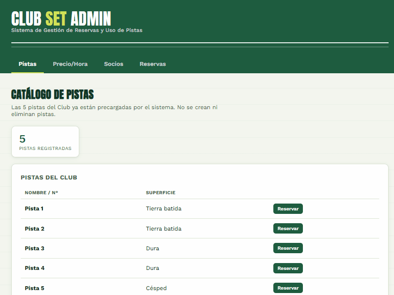
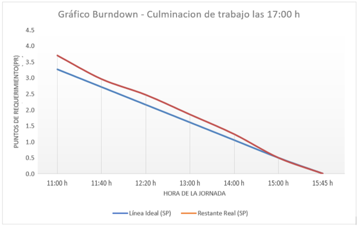

# 🎾 Club Set — Sistema de Gestión de Reservas y Uso de Pistas de Tenis

> **Proyecto académico** desarrollado bajo marco de trabajo **Scrum** con 3 Sprints, para la asignatura *Sistemas de Información II*.


---

## Descripción

Aplicación full-stack para la administración de un club de tenis. Permite gestionar pistas, socios, reservas por bloques de 1 hora, control de ocupación real, facturación mensual automática y consulta de historial por socio.

---

## Stack Tecnológico


| Capa | Tecnología |
|------|-----------|
| **Frontend** | HTML5 + CSS3 + Vanilla JavaScript (SPA sin framework) |
| **Backend** | Node.js + Express.js |
| **Persistencia** | JSON files (`pistas.json`, `socios.json`, `reservas.json`, `facturas.json`) |
| **Control de versiones** | Git + GitHub (Git Flow) |
| **Metodología** | Scrum (3 Sprints intensivos) |

---

## Equipo Scrum

| Rol | Nombre Completo |
|-----|----------------|
| **Product Owner** | Mirko Coca Flores |
| **Scrum Master** | Ian Nicolas Flores Candia |
| **Developer** | Katherin Izel Dominguez Mamani |
| **Developer** | Noemi Soledad Condori Gaspar |
| **Developer** | Alejandro Jimenez Mamani |

---

## Estructura del Proyecto

```
tenis-club/
├── backend/
│   ├── src/
│   │   ├── controllers/
│   │   │   └── reserva.controller.js
│   │   ├── models/
│   │   │   ├── reserva.model.js
│   │   │   ├── socio.model.js
│   │   │   ├── pista.model.js
│   │   │   └── factura.model.js
│   │   ├── routes/
│   │   │   └── reserva.routes.js
│   │   ├── data/
│   │   │   ├── pistas.json
│   │   │   ├── socios.json
│   │   │   ├── reservas.json
│   │   │   └── facturas.json
│   │   └── utils/
│   │       └── fileStorage.js
│   └── server.js
├── frontend/
│   └── index.html
└── README.md
```

---

## Product Backlog

| ID | Requerimiento | Prioridad | Est. (días) | Sprint | Responsable |
|----|--------------|-----------|-------------|--------|-------------|
| **AD01** | Registrar catálogo de pistas del Club (5 pistas) | 1 | 1 | **1** | Katherin |
| **AD02** | Parametrizar precio por hora de reserva | 2 | 1 | **1** | Katherin |
| **AD03** | Parametrizar tarifa mínima de penalización por cancelación | 3 | 1 | **1** | Alejandro |
| **AD04** | Dar de alta un socio | 4 | 1 | **1** | Noemi |
| **AD05** | Dar de baja a un socio | 5 | 1 | **1** | Noemi |
| **AD06** | Modificar datos de un socio | 6 | 1 | **1** | Noemi |
| **SO01** | Consultar disponibilidad de pistas por fecha y hora | 7 | 2 | **2** | Katherin / Alejandro |
| **SO02** | Reservar una pista por bloques de 1 hora (máx. 1 mes de anticipación) | 8 | 2 | **2** | Katherin / Alejandro |
| **SO03** | Cancelar una reserva existente (solo si no es el mismo día) | 9 | 2 | **2** | Noemi |
| **AD07** | Registrar la ocupación real de la pista reservada (ocupada / no ocupada) | 10 | 2 | **2** | Noemi |
| **AD08** | Calcular el importe mensual por horas reservadas y ocupación real | 11 | 3 | **3** | Katherin |
| **AD09** | Calcular el importe por cancelaciones del mes (tarifa de penalización) | 12 | 3 | **3** | Katherin |
| **AD10** | Generar y emitir la factura mensual a cada socio | 13 | 3 | **3** | Alejandro |
| **AD11** | Consultar el historial de reservas, ocupación y facturas de un socio | 14 | 3 | **3** | Noemi |

---

## Sprints

### Sprint 1 — Infraestructura y Parametrización
> **Duración:** 1 día
> **Objetivo:** Tener el club configurado (pistas, precios, tarifas, socios).

**Historias incluidas:**
- `AD01` — Catálogo de pistas (CRUD básico, activar/desactivar).
- `AD02` — Precio por hora vigente + historial de cambios.
- `AD03` — Tarifa mínima de penalización (castigo).
- `AD04` — Alta de socios.
- `AD05` — Baja de socios.
- `AD06` — Edición de datos de socios.

**Ramas activas:**
```
feature/hu1-hu2-pistas-precio             → Katherin
feature/hu3-tarifa-penalizacion           → Alejandro
feature/hu4-hu5-hu6-tarifa-castigo        → Noemi
```

**Hito del Sprint 1:** Todas las ramas se fusionaron exitosamente en la rama remota `feature/sprint1-integracion` para resolver conflictos de estilos globales, impactando finalmente en `develop`.

#### 🎬 DEMO
<!-- Reemplaza la ruta de abajo por el gif del Sprint 1, por ejemplo: ./assets/demo-sprint1.gif -->


---

### Sprint 2 — Flujo de Reservas y Asistencia
> **Duración:** 1 día
> **Objetivo:** Permitir a los socios reservar, cancelar y registrar uso real.

**Historias incluidas:**
- `SO01` — Matriz de disponibilidad por fecha/hora.
- `SO02` — Crear reserva (reglas: máx. 1 mes, no duplicar bloque, socio activo).
- `SO03` — Cancelar reserva (restricción: no mismo día) + aplicación de penalización fija.
- `AD07` — Confirmar ocupación real (`asistencia === 'asistio'`) o auto-cierre por vencimiento (`no_ocupada`).

**Ramas activas:**
```
feature/hu-so01-so02-disponibilidad-reserva   → Katherin / Alejandro
feature/hu-so03-ad07-registro-ocupacion       → Noemi
```

**Hito del Sprint 2:** Todas las ramas se fusionaron exitosamente en la rama remota `feature/sprint2-integracion` directo hacia `develop`.

#### 🎬 DEMO
<!-- Reemplaza la ruta de abajo por el gif del Sprint 2, por ejemplo: ./assets/demo-sprint2.gif -->


---

### Sprint 3 — Facturación, Penalizaciones y Auditoría
> **Duración:** 1 día
> **Objetivo:** Consolidar montos, emitir facturas y consultar historial completo.

**Historias incluidas:**
- `AD08` / **HU12** — Calcular importe mensual por horas con asistencia confirmada (`asistencia === 'asistio'`) × `precioActual`.
- `AD09` / **HU13** — Sumar penalizaciones por cancelaciones (`estado === 'Cancelada'`) y No-Shows (`uso === 'no_ocupada'`) al total de la factura.
- `AD10` / **HU14** — Consolidar uso + penalizaciones en objeto JSON `Factura`, persistirlo y renderizar documento imprimible (`@media print`).
- `AD11` / **HU15** — Nueva pestaña "Historial del Socio": consumir endpoint extendido `/socio/:id/historial` para listar reservas pasadas + facturas pagadas/pendientes.

**Ramas activas:**
```
feature/hu12-hu14-motor-facturacion   → Katherin
feature/hu13-importe-cancelaciones    → Alejandro
feature/hu15-historial-socio          → Noemi
```

**Hito del Sprint 3 (Hito del Proyecto):** Se rescató y estabilizó la configuración del backend (`package.json`, `server.js`) subsanando errores de importación de módulos (`fileStore` vs `fileStorage`). Todo el código del equipo se fusionó y testeó en la rama `feature/sprint3-integracion`. Una vez verificado el estado de salud del sistema, se realizó el merge definitivo a `develop` y, finalmente, se trasladó todo el historial limpio a la rama **`main`** para la entrega final al ingeniero.

#### 🎬 DEMO


### 📉 Gráfico Burndown

<center>
  
</center>


En el Burndown visualizamos los tiempos requeridos para la entrega del programa con toda la documentación correspondiente.

---

## Convenciones de Ramas y Commits

<details>
<summary><strong> Convenciones de Ramas (Git Flow) y Formato de Commits</strong> (clic para expandir)</summary>

### Convenciones de Ramas (Git Flow)

```
main          ← producción estable
  ↑
develop       ← integración continua de features
  ↑
  ├── feature/hu1-hu2-pistas-precio  
  ├── feature/hu3-tarifa-penalizacion 
  ├── feature/hu4-hu5-hu6-tarifa-castigo
  ├── feature/hu-so01-so02-disponibilidad-reserva 
  ├── feature/hu-so03-ad07-registro-ocupacion 
  ├── feature/hu12-hu14-motor-facturacion
  ├── feature/hu13-importe-cancelaciones
  └── feature/hu15-historial-socio
```

### Formato de commits

```
feat(AD01): agrega catálogo de pistas del club
feat(AD02): parametriza precio por hora con historial
feat(SO03): implementa cancelación con penalización por día
feat(HU12): calcula importe mensual por horas ocupadas
feat(HU13): suma penalizaciones por cancelación y no-show
feat(HU14): emite factura consolidada con vista de impresión
feat(HU15): maqueta pestaña Historial del Socio con tablas ordenadas
fix(backend): corrige importación de fileStorage en server.js
```

</details>

---

## Cómo ejecutar

### Backend
```bash
cd backend
npm install
npm start
# Servidor en http://localhost:3000
```

### Frontend
Abrir `frontend/index.html` directamente en el navegador o servirlo con Live Server.

> **Nota:** El frontend utiliza `localStorage` como respaldo cuando el backend no responde, permitiendo desarrollo y pruebas offline.

---

## Estado del Proyecto

| Sprint | Estado | Historias completadas | Responsables |
|--------|--------|----------------------|-------------|
| Sprint 1 | ✅ Finalizado | AD01 — AD06 | Katherin, Alejandro, Noemi |
| Sprint 2 | ✅ Finalizado | SO01 — SO03, AD07 | Katherin, Alejandro, Noemi |
| Sprint 3 | ✅ Finalizado | AD08 , AD09 , AD10 , AD11 | Katherin, Alejandro, Noemi |

---

## 🤝 Contributing


<table>
  <tbody>
    <tr>
      <td align="center">
        <a href="https://github.com/MirkoCF2701">
          <br />
          <sub><b>Mirko Coca Flores</b></sub>
        </a><br />
        <sub>Product Owner</sub>
      </td>
      <td align="center">
        <a href="https://github.com/Nicocolachikoko">
          <br />
          <sub><b>Ian Nicolas Flores Candia</b></sub>
        </a><br />
        <sub>Scrum Master</sub>
      </td>
      <td align="center">
        <a href="https://github.com/KatherinDominguez">
          <br />
          <sub><b>Katherin Izel Dominguez Mamani</b></sub>
        </a><br />
        <sub>Developer</sub>
      </td>
      <td align="center">
        <a href="https://github.com/NoemiS1">
          <br />
          <sub><b>Noemi Soledad Condori Gaspar</b></sub>
        </a><br />
        <sub>Developer</sub>
      </td>
      <td align="center">
        <a href="https://github.com/alejimgithud">
          <br />
          <sub><b>Alejandro Jimenez Mamani</b></sub>
        </a><br />
        <sub>Developer</sub>
      </td>
    </tr>
  </tbody>
</table>

---
